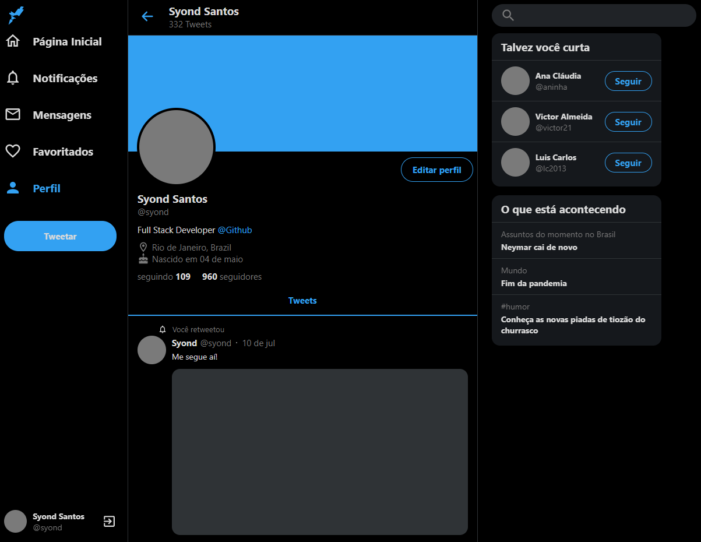
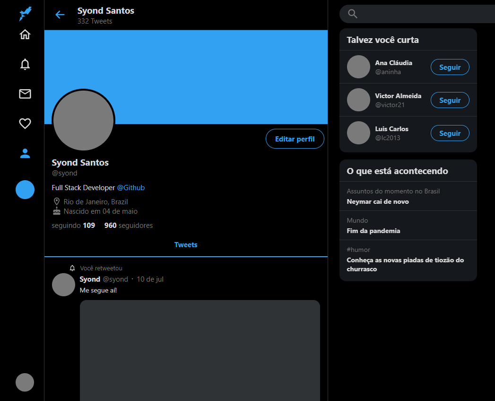
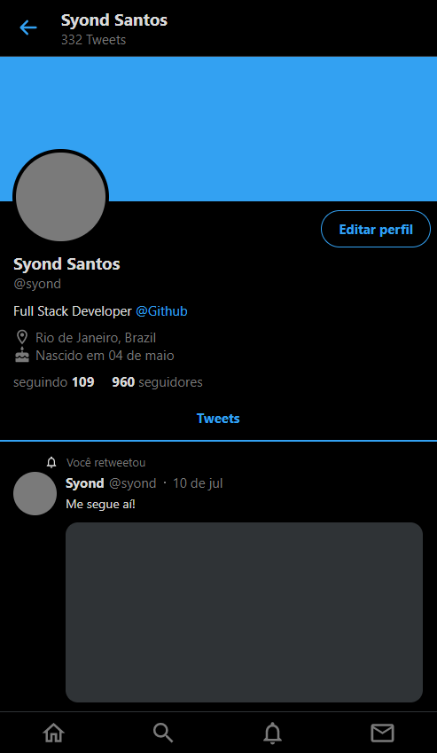

<h2 align="center">
    A Twitter interface clone developed with ReactJS :)
</h2>

  </a>
  </a>
  </a>

---

[Live Demo](https://twittersyond.netlify.app/)
 
## :coffee: About
It's a responsive Twitter interface clone. Mobile first concept was applied to this project.

## :runner: Goals
Learn more about front end using ReactJS and Styled Components.

## :floppy_disk: Installation

Before you start, you need to clone the repository using `git clone`.

Now just run `npm start` and you are ready to go! :)

## :email: Contact
syond94@gmail.com | 
[Linkedin](https://linkedin.com/in/syond)
